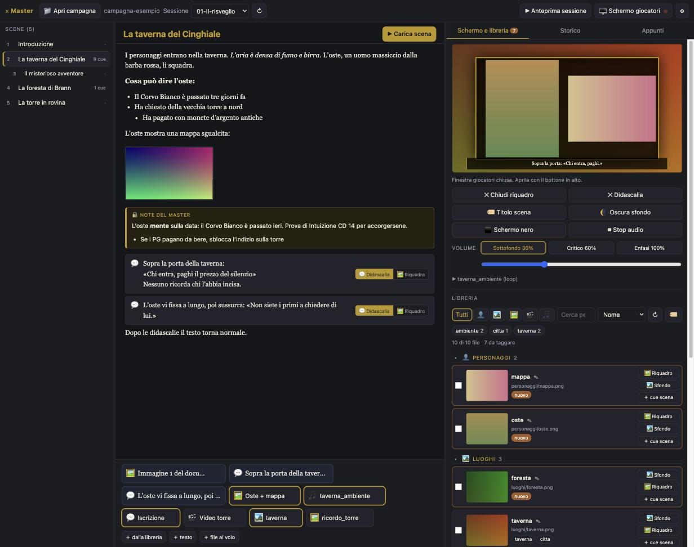

# MasterMe

**A game master's console for tabletop RPG sessions.**
Read your session notes on the laptop, and with one click show images, video, captions and sound to your players on a second screen.
One HTML file, nothing to install, and everything stays on your computer.



> **Language:** the interface is currently in Italian. This page is an English overview.
> The complete user manual is in Italian: [docs/manuale-it.md](docs/manuale-it.md).

---

## Contents

- [Features](#features)
- [Quick start](#quick-start)
- [Requirements](#requirements)
- [How the two screens work](#how-the-two-screens-work)
- [Campaign folder](#campaign-folder)
- [Writing a session in Word](#writing-a-session-in-word)
- [Cues](#cues)
- [Media library](#media-library)
- [Keyboard shortcuts](#keyboard-shortcuts)
- [Your data](#your-data)
- [Development](#development)
- [Known limitations and roadmap](#known-limitations-and-roadmap)
- [License](#license)

## Features

- **Two screens, one app.** A private console for the game master and a separate players' window for the TV or projector.
- **Your session is a Word document.** Headings become scenes. GM notes and player captions are just two more heading styles.
- **One-click cues.** Each scene has a bar of buttons for backgrounds, framed images, video, text and audio.
- **Two visual layers.** A full-screen location background, with a bordered frame on top for characters, clues or maps.
- **Live mosaic.** Switch on several image cues and they share the frame side by side, up to four at once.
- **Smart backgrounds.** Switching a background off brings back the scene's own background, or the last one from a previous scene.
- **Audio with volume presets.** One track at a time, with fades between *background*, *tense moment* and *emphasis* levels.
- **Tagged media library.** Images, video and audio are indexed by type, folder and free tags, and shared across sessions.
- **Ad-hoc content.** Drop any file on the console to show it right away, or bring back something from earlier with the history.
- **Rehearsal mode.** An automatic preview plays every scene of the session in order before game night.
- **Notes.** Per-scene and per-session notes, saved automatically.

## Quick start

1. Download [`dist/master.html`](dist/master.html). On GitHub, use the *Download raw file* button.
2. Open it in **Chrome** or **Edge** with a double click.
3. Click **Apri campagna** (*open campaign*) and pick a folder. An empty folder works: `sessioni/` and `media/` are created for you.
4. Put your Word session files in `sessioni/` and your images, video and audio in `media/`.
5. Click **Schermo giocatori** (*players' screen*), drag the new window to the second monitor and click inside it once.
   It switches to full screen and enables video sound.

To try it straight away, open the [`campagna-esempio/`](campagna-esempio/) folder from this repository: it contains two sample sessions, media and ready-made cues.

## Requirements

| Browser | Support |
|---|---|
| Chrome or Edge 103+, on Windows, macOS or Linux | Full support. Recommended. |
| Firefox, Safari | Limited fallback mode: the folder must be re-selected every time and saves are downloaded as files. |

No server, no Node.js, no internet connection. The file also works when opened from a USB stick.

## How the two screens work

The console opens the players' window itself and drives it directly, so every change is instant and nothing polls or reloads.

- **First run:** drag the players' window to the external screen and click it once. That click enables audio and switches to full screen.
- **Automatic placement:** in Chrome and Edge, if you allow the *window management* permission, the window moves to the second screen on its own.
- **Reconnecting:** if the window gets closed, open it again and it shows exactly what the players were seeing.
- **Live preview:** a thumbnail in the console always mirrors the players' screen, even when their window is closed.
- **Sound:** audio plays from the console, so it follows your system output, for example the HDMI audio of the TV.

## Campaign folder

```
my-campaign/
├── campaign.json     campaign name, volume presets, frame look       (created by the app)
├── library.json      media index: type, label, tags                  (created by the app)
├── master.json       cues per scene, notes, history                  (created by the app)
├── sessioni/         one .docx per session; a number prefix sets the order: 01-…, 02-…
└── media/            images, video, audio, in any sub-folders
    ├── personaggi/   images listed as Characters
    ├── luoghi/       images listed as Locations
    └── importati/    files dropped on the console and then imported
```

Files in `media/` can be added, moved or renamed in your file manager at any time. A refresh of the library picks them up and keeps their tags.

Supported formats: JPG, PNG, GIF, WebP, BMP, SVG and AVIF images; MP4, WebM, MOV, M4V and MKV video; MP3, OGG, WAV, M4A, AAC, FLAC and Opus audio.

## Writing a session in Word

Write the session as a normal Word document and use heading styles to give it structure.
Both the English and the localized style names work, for example *Heading 1* or *Titolo 1*.

| Word style | Becomes |
|---|---|
| **Title** | The session title. |
| **Heading 1** | A scene in the list on the left. |
| **Heading 2** | A sub-scene, indented in the list. |
| **Heading 3** | A **GM notes** block, visible only in the console, up to the next heading. |
| **Heading 4** | A **caption for the players**, shown only when the GM clicks it. |
| Normal text | The scene text, with bold, italic, lists, tables and images. |

```
Session 3 – The Tower                     (Title)

The Boar Tavern                           (Heading 1  → scene)
The characters walk into the tavern…      (Normal)
[pasted image]                            (→ image cue, off until clicked)
GM notes                                  (Heading 3  → private block)
The innkeeper is lying about the date…    (Normal, part of the notes)
Above the door: ⏎ "Whoever enters, pays"  (Heading 4  → caption; ⏎ = Shift+Enter)
Nobody remembers who carved it.           (Heading 4  → same caption, next line)
                                          (empty line → starts a new caption)
The innkeeper stares at you…              (Heading 4  → another caption)

The Brann Forest                          (Heading 1  → scene)
```

- **Captions** can be shown at the bottom of the screen or as a card in the frame, with a selector right next to each one.
  Consecutive Heading 4 paragraphs merge into one multi-line caption; an empty line separates them.
- **Pasted images** appear in the text and in the cue bar. A click shows them in the frame and a second click hides them.
  Hover an image to show it as a background instead, or to save it as a regular scene cue.
  Saved image cues stay linked even if you add or reorder images in Word.
- **Editing the document** while the console is open is fine: press the refresh button next to the session selector.

## Cues

| Cue | On the players' screen |
|---|---|
| 🏞 Background | Full-screen location image. Clicking it again switches it off. |
| 🖼 Frame | Image in a bordered frame above the background. Several frames on at once form a mosaic. |
| 🎬 Video | Video in the frame or full screen, with sound. |
| 📝 Text | A card in the frame, a caption at the bottom, or a large title. |
| 🎵 Audio | One track at a time, with a volume preset and optional loop. |

Cues are added from the library, typed in, or dropped as files. They can be reordered by dragging and edited with ✎ or a right click.

**Loading a scene.** Selecting a scene applies its saved cues: the first background, frame or video, text and audio.
Frames and captions from the previous scene are always cleared; the background stays until a new one is planned.
Captions and images from the Word document never start on their own. This automatic loading can be turned off in the settings.

**Backgrounds.** When a background is switched off, the console looks for the scene's own background, then walks back through the previous scenes until it finds one.
A scene without a background of its own inherits the most recent one, so the players always see the right place.

**Mosaic.** The frame holds up to four images: two side by side, three in a row, or a two-by-two grid.

**Session preview.** Plays every scene in order for a few seconds each, muted by default, with pause and skip controls.

## Media library

- **Sections:** Characters, Locations, other images, Video and Audio. Images are sorted by their sub-folder in `media/`.
- **Search:** combine type, tags and name. Only the tags present in the selected type are offered, each with its count.
- **Tagging:** free tags with autocomplete, bulk add and remove, rename, merge and colour.
- **Housekeeping:** new files are flagged as *to tag*, and missing files stay listed until you remove them.

## Keyboard shortcuts

| Key | Action |
|---|---|
| `B` | Black screen |
| `Esc` | Close the frame |
| `Space` | Stop audio |
| `1` `2` `3` | Volume preset |
| `↑` `↓` | Previous or next scene |
| `Enter` | Load the current scene |
| `F` | Full screen, in the players' window |

## Your data

MasterMe runs entirely in your browser and never sends anything over the network.

- **Campaign data** is plain JSON inside your campaign folder, so it can be backed up, synced or put under version control.
- **Browser storage** only keeps the permission to reopen the folder and a cache of thumbnails.
- **Your files** are never uploaded, copied elsewhere or modified, except for the JSON files above and the imports you request.

## Development

The app is plain HTML, CSS and JavaScript with no dependencies and no build tools beyond a shell.

| Path | Contents |
|---|---|
| `src/index.html` | Console markup and dialogs |
| `src/styles.css` | Console styles |
| `src/app.js` | Console logic: sessions, scenes, cues, library, audio, preview |
| `src/player.js` | The players' screen, injected into its window and into the preview |
| `src/docx.js`, `src/zip.js` | Minimal ZIP reader and Word parser |
| `src/platform.js` | File system and storage adapter, ready for a future desktop build |
| `build.sh` | Inlines everything into `dist/master.html` |
| `campagna-esempio/` | Sample campaign |
| `docs/` | Italian manual and design notes |

```sh
./build.sh                                # writes dist/master.html
node --check src/*.js                     # optional syntax check
python3 -m http.server 8765               # optional local server for testing
```

Edit the files in `src/`, run `./build.sh`, and reload `dist/master.html`.

## Known limitations and roadmap

- **Italian interface.** Translations are welcome.
- **Browser prompts.** The browser asks to confirm folder access at each start, and the players' window needs one click to enable sound.
  A desktop build with Electron, described in [docs/html-based.md](docs/html-based.md), would remove both.
- **Office drawings.** Images stored as EMF or WMF, typical of Office shapes and charts, cannot be displayed. Save them as JPG or PNG.

## License

Released under the [MIT License](LICENSE).
